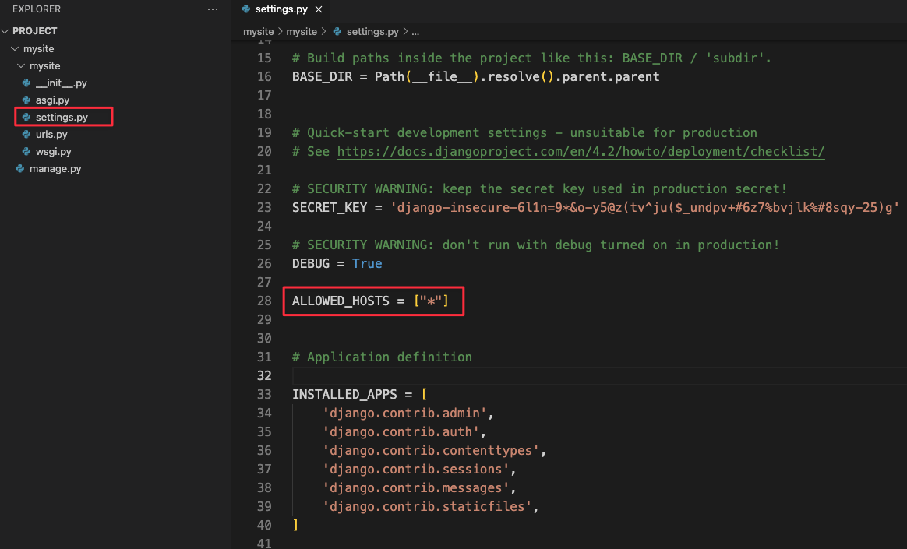
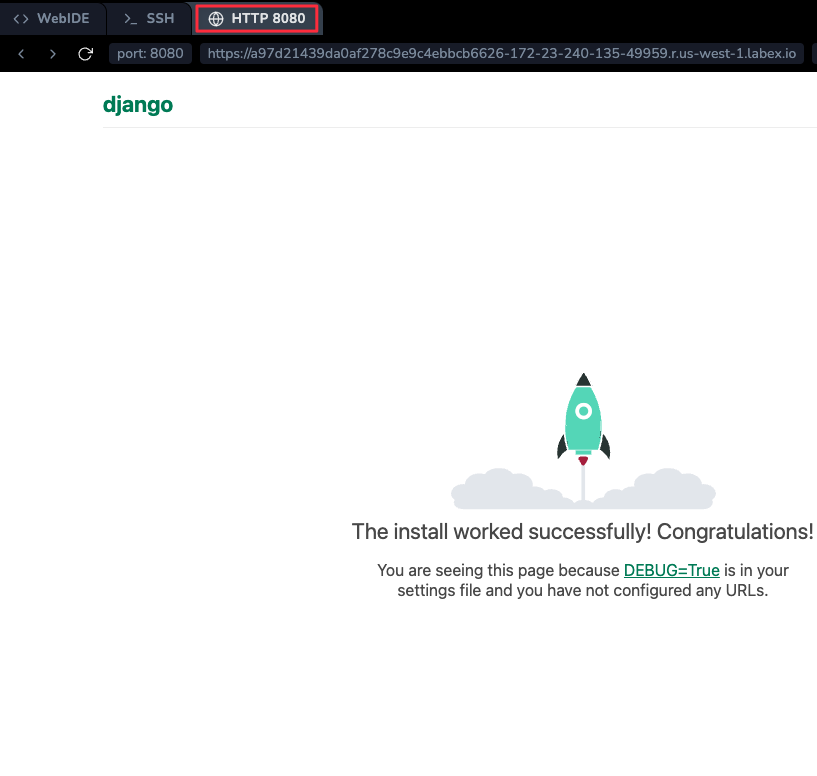

# 开发服务器

让我们验证一下你的 Django 项目是否正常工作。如果你还没有进入外部的 `mysite` 目录，请切换进去，然后运行以下命令：

```bash
cd ~/project/mysite
python manage.py runserver
```

你会在命令行中看到以下输出：

```plaintext
Performing system checks...

System check identified no issues (0 silenced).

You have unapplied migrations; your app may not work properly until they are applied. Run 'python manage.py migrate' to apply them.

- 15:50:53 Django version, using settings'mysite.settings' Starting development server at <http://127.0.0.1:8000/> Quit the server with CONTROL-C.
```

现在先忽略关于未应用数据库迁移的警告；我们很快会处理数据库。

你已经启动了 Django 开发服务器，这是一个完全用 Python 编写的轻量级 Web 服务器。我们将其包含在 Django 中，以便你可以快速开发，直到准备好投入生产之前，无需处理诸如 Apache 等生产服务器的配置。

现在需要注意：**不要** 在任何类似生产环境的场景中使用此服务器。它仅用于开发阶段。（我们是做 Web 框架的，不是做 Web 服务器的。）

现在服务器正在运行，用你的网页浏览器访问 <http://127.0.0.1:8000/>。或者，在终端中运行 `curl 127.0.0.1:8000`。你会看到一个“恭喜！”页面，上面有一枚火箭起飞。成功了！

在 LabEx VM 中，我们需要将 LabEx 域名添加到 `ALLOWED_HOSTS` 中。编辑 `mysite/settings.py`，并在 `ALLOWED_HOSTS` 的末尾添加 `*`，使其如下所示：

```python
ALLOWED_HOSTS = ["*"]
```

这告诉 Django 它被允许处理任何主机头的请求。



## 更改端口

默认情况下，`runserver` 命令会在内部 IP 的 8000 端口上启动开发服务器。

如果你想更改服务器的端口，可以将其作为命令行参数传递。例如，此命令会在 8080 端口上启动服务器：

```bash
python manage.py runserver 8080
```

如果你想更改服务器的 IP，可以将其与端口一起传递。例如，要监听所有可用的公共 IP（如果你正在运行 Vagrant 或者想在网络上的其他计算机上展示你的工作成果，这会很有用），使用：

```bash
python manage.py runserver 0.0.0.0:8080
```

现在，切换到 LabEx VM 中的“Web 8080”标签页，你会看到相同的“恭喜”页面。



开发服务器的完整文档可以在 `runserver` 参考文档中找到。

> `runserver` 的自动重新加载
> 开发服务器会根据需要为每个请求自动重新加载 Python 代码。你无需为了使代码更改生效而重新启动服务器。然而，某些操作（如添加文件）不会触发重新启动，所以在这些情况下你必须重新启动服务器。
