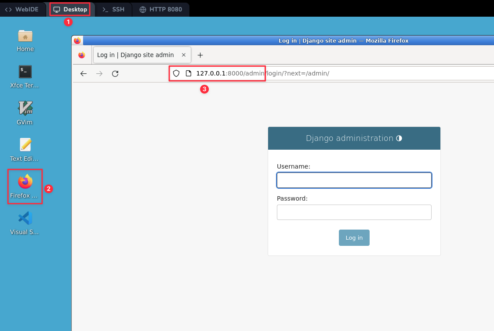
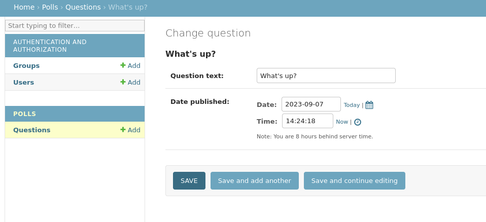

# Introducing the Django Admin

Generating admin sites for your staff or clients to add, change, and delete content is tedious work that doesn't require much creativity. For that reason, Django entirely automates creation of admin interfaces for models.

Django was written in a newsroom environment, with a very clear separation between "content publishers" and the "public" site. Site managers use the system to add news stories, events, sports scores, etc., and that content is displayed on the public site. Django solves the problem of creating a unified interface for site administrators to edit content.

The admin isn't intended to be used by site visitors. It's for site managers.

## Creating an admin user

First we'll need to create a user who can login to the admin site. Run the following command:

```bash
python manage.py createsuperuser
```

Enter your desired username and press enter.

```plaintext
Username: admin
```

You will then be prompted for your desired email address:

```plaintext
Email address: admin@example.com
```

The final step is to enter your password. You will be asked to enter your password twice, the second time as a confirmation of the first.

```plaintext
Password: 12345678
Password (again): 12345678

This password is too common.
This password is entirely numeric.
Bypass password validation and create user anyway? [y/N]: y
Superuser created successfully.
```

## Start the development server

The Django admin site is activated by default. Let's start the development server and explore it.

If the server is not running start it like so:

```bash
python manage.py runserver
```

Now, open a web browser in **VNC** tab, and go to "/admin/" on your local domain -- e.g., `http://127.0.0.1:8000/admin/`. You should see the admin's login screen:



Since `translation </topics/i18n/translation>` is turned on by default, if you set `LANGUAGE_CODE`, the login screen will be displayed in the given language (if Django has appropriate translations).

## Enter the admin site

Now, try logging in with the superuser account you created in the previous step. You should see the Django admin index page:


You should see a few types of editable content: groups and users. They are provided by `django.contrib.auth`, the authentication framework shipped by Django.

## Make the poll app modifiable in the admin

But where's our poll app? It's not displayed on the admin index page.

Only one more thing to do: we need to tell the admin that `Question` objects have an admin interface. To do this, open the `polls/admin.py` file, and edit it to look like this:

```python
from django.contrib import admin

from .models import Question

admin.site.register(Question)
```

## Explore the free admin functionality

Now that we've registered `Question`, Django knows that it should be displayed on the admin index page:


Click "Questions". Now you're at the "change list" page for questions. This page displays all the questions in the database and lets you choose one to change it. There's the "What's up?" question we created earlier:


Click the "What's up?" question to edit it:



Things to note here:

- The form is automatically generated from the `Question` model.
- The different model field types (`~django.db.models.DateTimeField`, `~django.db.models.CharField`) correspond to the appropriate HTML input widget. Each type of field knows how to display itself in the Django admin.
- Each `~django.db.models.DateTimeField` gets free JavaScript shortcuts. Dates get a "Today" shortcut and calendar popup, and times get a "Now" shortcut and a convenient popup that lists commonly entered times.

The bottom part of the page gives you a couple of options:

- Save -- Saves changes and returns to the change-list page for this type of object.
- Save and continue editing -- Saves changes and reloads the admin page for this object.
- Save and add another -- Saves changes and loads a new, blank form for this type of object.
- Delete -- Displays a delete confirmation page.

If the value of "Date published" doesn't match the time when you created the question in **Creation of a Basic Poll Application**, it probably means you forgot to set the correct value for the `TIME_ZONE` setting. Change it, reload the page and check that the correct value appears.

Change the "Date published" by clicking the "Today" and "Now" shortcuts. Then click "Save and continue editing." Then click "History" in the upper right. You'll see a page listing all changes made to this object via the Django admin, with the timestamp and username of the person who made the change:


When you're comfortable with the models API and have familiarized yourself with the admin site, read **Creating the Public Interface Views** to learn about how to add more views to our polls app.
