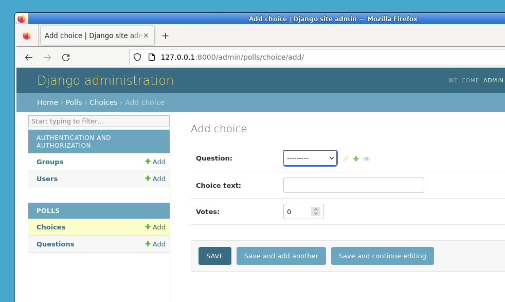
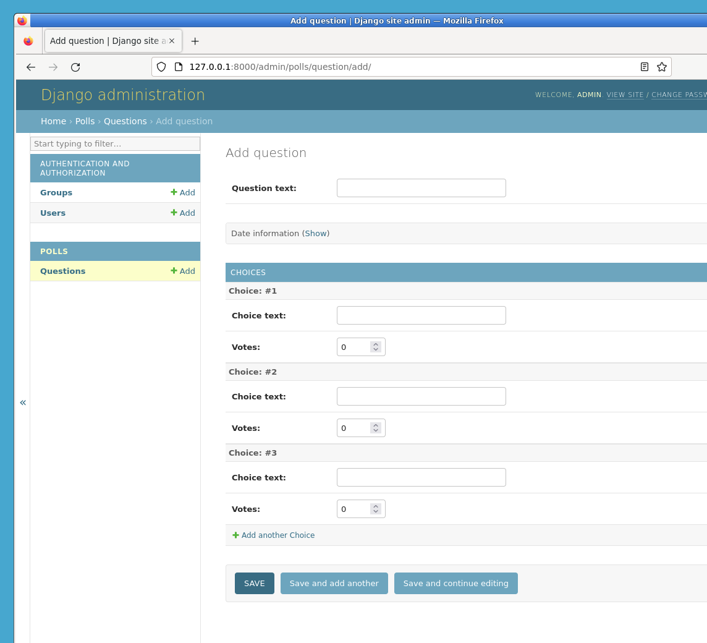
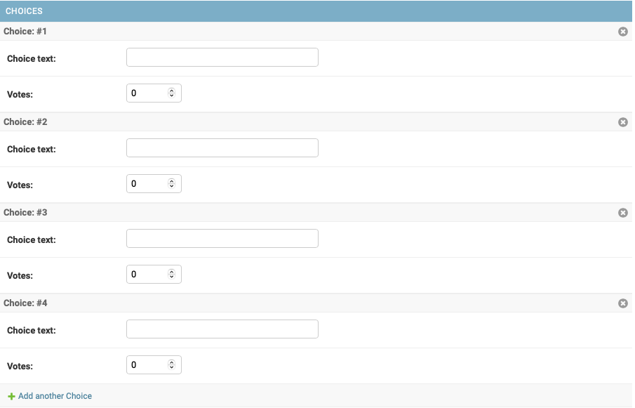

# Adding related objects

OK, we have our Question admin page, but a `Question` has multiple `Choice`s, and the admin page doesn't display choices.

Yet.

There are two ways to solve this problem. The first is to register `Choice` with the admin just as we did with `Question`:

```python
from django.contrib import admin

from .models import Choice, Question

# ...
admin.site.register(Choice)
```

Now "Choices" is an available option in the Django admin. The "Add choice" form looks like this:



In that form, the "Question" field is a select box containing every question in the database. Django knows that a `~django.db.models.ForeignKey` should be represented in the admin as a `<select>` box. In our case, only one question exists at this point.

Also note the "Add another question" link next to "Question." Every object with a `ForeignKey` relationship to another gets this for free. When you click "Add another question", you'll get a popup window with the "Add question" form. If you add a question in that window and click "Save", Django will save the question to the database and dynamically add it as the selected choice on the "Add choice" form you're looking at.

But, really, this is an inefficient way of adding `Choice` objects to the system. It'd be better if you could add a bunch of Choices directly when you create the `Question` object. Let's make that happen.

Remove the `register()` call for the `Choice` model. Then, edit the `Question` registration code to read:

```python
from django.contrib import admin

from .models import Choice, Question


class ChoiceInline(admin.StackedInline):
    model = Choice
    extra = 3


class QuestionAdmin(admin.ModelAdmin):
    fieldsets = [
        (None, {"fields": ["question_text"]}),
        ("Date information", {"fields": ["pub_date"], "classes": ["collapse"]}),
    ]
    inlines = [ChoiceInline]


admin.site.register(Question, QuestionAdmin)
```

This tells Django: "`Choice` objects are edited on the `Question` admin page. By default, provide enough fields for 3 choices."

Load the "Add question" page to see how that looks:



It works like this: There are three slots for related Choices -- as specified by `extra` -- and each time you come back to the "Change" page for an already-created object, you get another three extra slots.

At the end of the three current slots you will find an "Add another Choice" link. If you click on it, a new slot will be added. If you want to remove the added slot, you can click on the X to the top right of the added slot. This image shows an added slot:



One small problem, though. It takes a lot of screen space to display all the fields for entering related `Choice` objects. For that reason, Django offers a tabular way of displaying inline related objects. To use it, change the `ChoiceInline` declaration to read:

```python
class ChoiceInline(admin.TabularInline):
    ...
```

With that `TabularInline` (instead of `StackedInline`), the related objects are displayed in a more compact, table-based format:


Note that there is an extra "Delete?" column that allows removing rows added using the "Add another Choice" button and rows that have already been saved.
