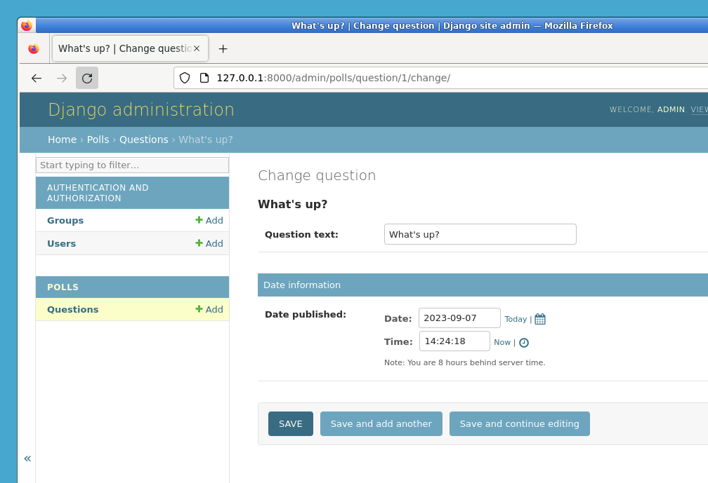

# 自定义管理表单

通过使用 `admin.site.register(Question)` 注册 `Question` 模型，Django 能够构建默认的表单表示形式。通常，你会希望自定义管理表单的外观和工作方式。你可以在注册对象时告诉 Django 你想要的选项来实现这一点。

让我们通过重新排列编辑表单上的字段来看看这是如何工作的。将 `admin.site.register(Question)` 这一行替换为：

编辑 `~/project/mysite/polls/admin.py` 文件，使其如下所示：

```python
from django.contrib import admin

from.models import Question


class QuestionAdmin(admin.ModelAdmin):
    fields = ["pub_date", "question_text"]


admin.site.register(Question, QuestionAdmin)
```

每当你需要更改模型的管理选项时，你都将遵循此模式 —— 创建一个模型管理类，然后将其作为第二个参数传递给 `admin.site.register()`。

运行 Django 开发服务器：

```bash
cd ~/project/mysite
python manage.py runserver
```

在桌面环境的 Firefox 中打开 `http://127.0.0.1:8000/admin/`，然后点击 “Questions” 链接。你应该会看到一个如下所示的表单。

上面这个特定的更改使得 “发布日期” 字段出现在 “问题” 字段之前：


对于只有两个字段的情况，这可能并不明显，但对于有几十个字段的管理表单来说，选择一个直观的顺序是一个重要的可用性细节。

说到有几十个字段的表单，你可能希望将表单拆分为多个字段集：

```python
from django.contrib import admin

from.models import Question


class QuestionAdmin(admin.ModelAdmin):
    fieldsets = [
        (None, {"fields": ["question_text"]}),
        ("日期信息", {"fields": ["pub_date"]}),
    ]


admin.site.register(Question, QuestionAdmin)
```

`~django.contrib.admin.ModelAdmin.fieldsets` 中每个元组的第一个元素是字段集的标题。这是我们现在的表单样子：


