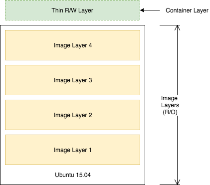
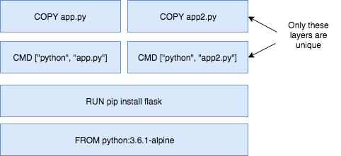

# Step 6: Understanding Image Layers

One of the major design properties of Docker is its use of the union file system.

Consider the `Dockerfile` that we created before:

```bash
FROM python:3.8-alpine
RUN pip install flask
CMD ["python","app.py"]
COPY app.py /app.py
```

Each of these lines is a layer. Each layer contains only the delta, diff or changes from the layers before it. To put these layers together into a single running container, Docker makes use of the `union file system` to overlay layers transparently into a single view.

Each layer of the image is `read-only`, except for the very top layer which is created for the running container. The read/write container layer implements "copy-on-write" which means that files that are stored in lower image layers are pulled up to the read/write container layer only when edits are being made to those files. Those changes are then stored in the running container layer. The "copy-on-write" function is very fast, and in almost all cases, does not have a noticeable effect on performance. You can inspect which files have been pulled up to the container level with the `docker diff` command. More information about how to use `docker diff` can be found [here](https://docs.docker.com/engine/reference/commandline/diff/).



Since image layers are `read-only`, they can be shared by images and by running containers. For instance, creating a new python app with its own Dockerfile with similar base layers, would share all the layers that it had in common with the first python app.

```bash
FROM python:3.8-alpine
RUN pip install flask
CMD ["python","app2.py"]
COPY app2.py /app2.py
```



You can also experience the sharing of layers when you start multiple containers from the same image. Since the containers use the same read-only layers, you can imagine that starting up containers is very fast and has a very low footprint on the host.

You may notice that there are duplicate lines in this Dockerfile and the Dockerfile you created earlier in this lab. Although this is a very trivial example, you can pull common lines of both Dockerfiles into a "base" Dockerfile, that you can then point to with each of your child Dockerfiles using the `FROM` command.

Image layering enables the docker caching mechanism for builds and pushes. For example, the output for your last `docker push` shows that some of the layers of your image already exists on the Docker Hub.

```bash
$ docker push $DOCKERHUB_USERNAME/python-hello-world
```

To look more closely at layers, you can use the `docker image history` command of the python image we created.

```bash
$ docker image history python-hello-world
```

Each line represents a layer of the image. You'll notice that the top lines match to your Dockerfile that you created, and the lines below are pulled from the parent python image. Don't worry about the "\<missing\>" tags. These are still normal layers; they have just not been given an ID by the docker system.
