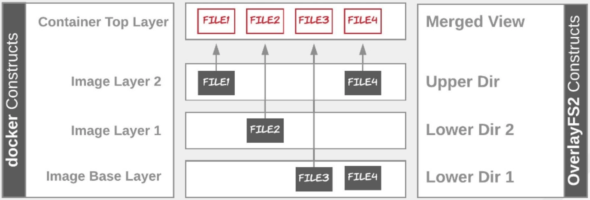

# [可选] OverlayFS

OverlayFS是Linux的一种「联合挂载文件系统」实现。要理解什么是Docker卷，有助于了解层和文件系统在Docker中是如何工作的。

要启动一个容器，Docker会获取只读镜像并在其之上创建一个新的读写层。为了将这些层视为一个整体，Docker使用联合文件系统或OverlayFS（覆盖文件系统），具体来说是`overlay2`存储驱动程序。

要查看由Docker主机管理的文件，你需要访问Docker进程文件系统。使用`--privileged`和`--pid=host`标志，你可以从像`busybox`这样的容器内部访问主机的进程ID命名空间。然后，你可以浏览到Docker的`/var/lib/docker/overlay2`目录，查看由Docker管理的已下载层。

要查看Docker中当前的层列表：

```bash
$ docker run -it --privileged --pid=host busybox nsenter -t 1 -m -u -n -i sh

/ # ls -l /var/lib/docker/overlay2
total 16
drwx------ 3 root root 4096 Sep 25 19:44 0e55ecaa4d17c353191e68022d9a17fde64fb5e9217b07b5c56eb4c74dad5b32
drwx------ 5 root root 4096 Sep 25 19:44 187854d05ccd18980642e820b0d2be6a127ba85d8ed96315bb5ae37eb1add36d
drwx------ 4 root root 4096 Sep 25 19:44 187854d05ccd18980642e820b0d2be6a127ba85d8ed96315bb5ae37eb1add36d-init
drwx------ 2 root root 4096 Sep 25 19:44 l

/ # exit
```

拉取`ubuntu`镜像并再次检查：

```bash
docker pull ubuntu
docker run -it --privileged --pid=host busybox nsenter -t 1 -m -u -n -i sh
```

再次输入命令查看层列表：

```
ls -l /var/lib/docker/overlay2/ & exit
```

你会看到拉取`ubuntu`镜像时，隐式地拉取了4个新层：

- a611792b4cac502995fa88a888261dfba0b5d852e72f9db9e075050991423779
- d181f1a41fc35a45c16e8bfcb8eee6f768f3b98f82210a43ea65f284a45fcd65
- dac2f37f6280a076836d39b87b0ae5ebf5c0d386b6d8b991b103aadbcebaa7c6
- f3e921b440c37c86d06cd9c9fb70df50edad553c36cc87f84d5eeba734aae709

`overlay2`存储驱动程序本质上是将主机上的不同目录分层，并将它们呈现为一个单一目录。

- 基础层或lowerdir
- `diff`层或upperdir
- 覆盖层（用户视图）
- `work`目录

OverlayFS将较低的目录称为`lowerdir`，其中包含基础镜像和拉取下来的只读（R/O）层。

上层目录称为`upperdir`，是读写（R/W）容器层。

统一视图或`overlay`层称为`merged`。

最后，`workdir`是必需的，它是overlay用于内部使用的空目录。

`overlay2`驱动程序最多支持128个较低的OverlayFS层。`l`目录包含作为符号链接的缩短层标识符。



清理：

```bash
docker system prune -a
clear
```
