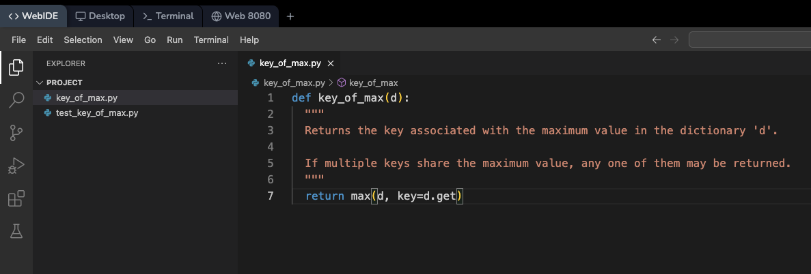

# Creating the Basic Function

Let's start by creating the core of our function. We'll build it up step-by-step. First, create a file named `key_of_max.py`. You can use the built-in LabEx code editor, or a terminal-based editor like `nano` or `vim`. Inside `key_of_max.py`, add the following code:



```python
def key_of_max(d):
  """
  Returns the key associated with the maximum value in the dictionary 'd'.

  If multiple keys share the maximum value, any one of them may be returned.
  """
  return max(d, key=d.get)
```

Here's a breakdown:

- **`def key_of_max(d):`**: This defines a function named `key_of_max`. It takes one argument, `d`, which represents the dictionary we'll be working with.
- **`return max(d, key=d.get)`**: This is the heart of the function. Let's analyze it piece by piece:
  - **`max(d, ...)`**: The built-in `max()` function finds the largest item. By default, if you give `max()` a dictionary, it will find the largest _key_ (alphabetically). We don't want that; we want the key _associated with_ the largest _value_.
  - **`key=d.get`**: This is the crucial part. The `key` argument tells `max()` how to compare items. `d.get` is a method of dictionaries. When you call `d.get(some_key)`, it returns the _value_ associated with `some_key`. By setting `key=d.get`, we're telling `max()`: "Compare the items in the dictionary `d` by using their _values_, not their keys." The `max()` function then returns the _key_ corresponding to that maximum value.
